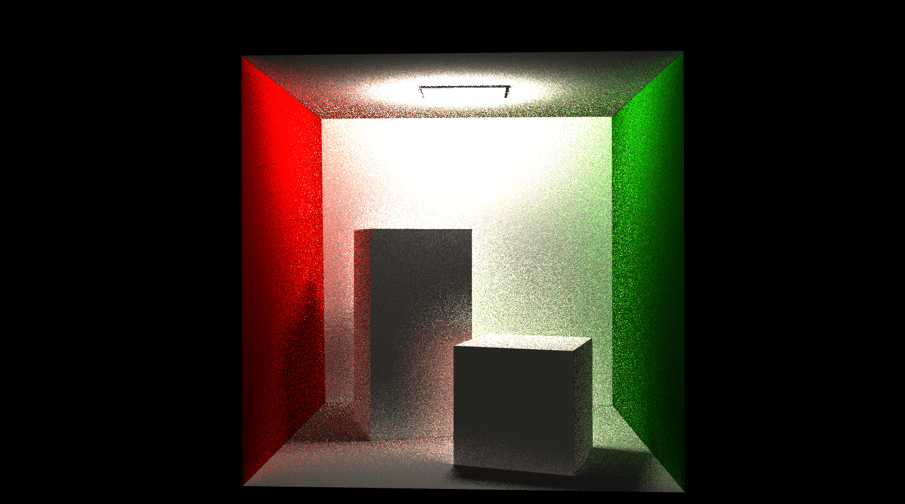

# MineRay

使用Optix为框架实现的光线追踪算法。

包含4个示例，直射光阴影效果、漫反射阴影效果、镜面反射效果、折射效果

## 环境需求

本项目在Windows 10中测试，以下环境为Windows中的环境

> CUDA 10.1
>
> OptiX 7 SDK
>
> cmake

## 编译方式

使用cmake编译

1. 打开```MineRay/common/gdt/cmake/FindOptiX.cmake```，在配置OptiX路径中确保其含有本机实际安装OptiX的路径
2. 在```CMake GUI``` 设置"source directory"至当前目录
3. 设置"build directory"至"当前目录/build"
4. 点击"configure"，设置平台为x64，Visual Studio 2017以上
5. 点击"generate"生成
6. 点击"open project"使用Visual Studio打开项目编译

## 操作方式

- 右键按住并拖动旋转视角
- 'w'向前移动，'s'向后移动，'a'向左移动，'d'向右移动
- 'left shift'向上移动
- 'left ctrl'向下移动

## 示例简介

### 0x00_direct 直射光

显示顶部光源对物体造成的阴影效果


### 0x01_soft 漫反射

设置每一个面为模糊材质，显示顶部光源对物体形成模糊的阴影效果



### 0x02_mirror 镜面反射

显示平面镜全反射和球面镜全反射的效果


### 0x03_refraction 折射

实现水面折射，玻璃球折射形成的凸透镜效果，以及带颜色的折射


## 文件说明

**models**文件夹：本示例中使用的模型

**png**文件夹：演示示例的图片

### 示例代码文件夹

对于每一个实例，都包含两个代码

1. **main.cpp**: 该实例的主函数，使用Model读取模型，使用CameraWindow创建glfw窗口，使用OptixRenderer构建optix环境，最后启动程序；
2. **devicePrograms.cu**: 包含OptiX流水线中的函数cuda代码，该代码由nvcc编译后被OptixRenderer读取后用于创建Optix环境

### common

该文件夹包含各个实例共用的部分

**3rdParty**: 一些第三方库，如glfw, tinyobj等

**gdt**: 开源的库，包含几何方面的数学功能函数和结构体，配置OptiX的CMake文件等

**MainWindow**: 我们使用glfw实现的窗口

1. **MainWindow.h/MainWindow.cpp**: MainWindow类，封装glfw的功能，实现窗口构建，键盘、鼠标消息读取，窗口主循环的实现
2. **CameraWindow.h/CameraWindow.cpp**: CameraWindow类，继承自MainWindow. 在MainWindow基础上实现了键盘和鼠标控制相机变化的功能

**OptixRenderer**: 使用OptiX渲染的功能，方便main中将Optix渲染内容与glfw窗口对接

1. **CUDABuffer.h**: 使用CUDA在GPU中缓存数据的功能
2. **LaunchParams.h**: 启动参数结构体，需要从CPU传入OptiX的结构
3. **Model.h/Model.cpp**: 模型读取类，使用tinyobj读取模型，存储在Model类
4. **optix7.h**: OptiX相关头文件以及宏
5. **OptixRenderer.h/OptixRenderer.cpp**:  OptiX渲染类，将CPU与OptiX交接的功能类。包含初始化OptiX环境，构建流水线，传输参数等功能。

